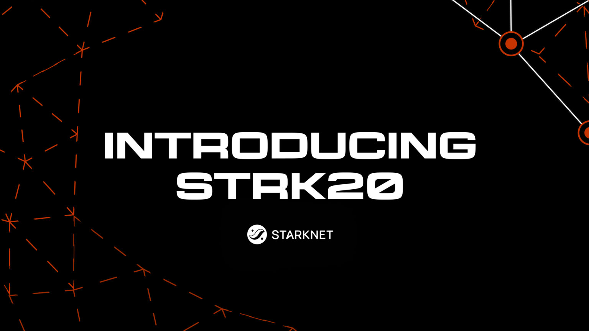

# Awesome STRK20 

> A curated list of resources, tools, and reference implementations for building private applications on Starknet with **STRK20** - the privacy pool that brings shielded balances, private transfers, and private DeFi to any ERC-20 on Starknet.

STRK20 is a note-based privacy pool (not a mixer): shielding deposits an ERC-20 into the pool as an encrypted note, and private transfers spend existing notes to create new ones. Every private transaction carries a STARK proof that Starknet verifies in-protocol. Inside the pool, sender, recipient, amounts, and token type are hidden; deposit and withdrawal amounts (the public ERC-20 legs) stay visible.

## Contents

- [Core Protocol](#core-protocol)
- [SDKs & Client Libraries](#sdks--client-libraries)
- [Wallet Integration](#wallet-integration)
- [Shadow Accounts](#shadow-accounts)
- [Anonymizer & Helper Contracts](#anonymizer--helper-contracts)
- [Live Apps & Integrations](#live-apps--integrations)
- [Proof-of-Concept Apps](#proof-of-concept-apps)
- [App Ideas to Build](#app-ideas-to-build)
- [Guides & Docs](#guides--docs)
- [Wallets](#wallets)
- [Community](#community)
- [Contributing](#contributing)

## Core Protocol

*The privacy pool everything else builds on, plus the cryptography behind it.*

- [STRK20 site](https://strk20.starknet.io/) - The home of the Starknet privacy pool: what it is, who's building on it, and how to get started.
- [Scalable Compliant Privacy on Starknet (whitepaper)](https://eprint.iacr.org/2026/474) - The academic paper describing the protocol, its proof system, and its selective-disclosure model.
- [Canonical privacy pool contract](https://voyager.online/contract/0x040337b1af3c663e86e333bab5a4b28da8d4652a15a69beee2b677776ffe812a) - The deployed pool contract on Starknet mainnet, viewable on Voyager.
- [Prover crate](https://github.com/starkware-libs/sequencer/tree/main/crates/starknet_transaction_prover) - Open-source prover for the privacy pool; lets advanced teams self-host proving instead of relying on hosted proving services.

## SDKs & Client Libraries

*Programmatic access to the pool for wallets and advanced integrators.*

- [Privacy SDK](https://github.com/starkware-libs/starknet-privacy/blob/main/sdk/README.md) ([v0.14.3-RC.8](https://github.com/starkware-libs/starknet-privacy/releases/tag/PRIVACY-0.14.3-RC.8)) - The Apache-2.0 TypeScript SDK for wallets and advanced integrations. It handles viewing-key registration, channels and per-token subchannels, discovery, proving, and multi-action private transactions. The current release line also exposes `build().shadowAccounts(dappName)` plus commitment and deterministic-address helpers for shadow accounts. Normal connected-wallet dapps should prefer the Wallet API below.
- [starknet.js v10.8.0](https://github.com/starknet-io/starknet.js/releases/tag/v10.8.0) - The current stable release. `WalletAccountV6` exposes all five STRK20 actions, including `shadow_account_invoke`, and lets a dapp request shadow-account commitments without handling viewing keys or proofs. The v11 line remains on the `next` / prerelease channel.
- [Privacy Bridge](https://github.com/starkware-libs/privacy-bridge) - A value-movement engine (Apache 2.0) that moves USDC between everyday EVM wallets/chains and the pool over Circle's CCTP, so a user can fund a private balance and later withdraw it without the two sides being linked on-chain: deposit from an EVM wallet as a private note, withdraw to a destination EVM chain, bridge back in, or cash out. Ships the framework-agnostic `@starkware-libs/starknet-privacy-bridge` TypeScript engine (plus optional React hooks), the [inbound/outbound Cairo anonymizers](#anonymizer--helper-contracts), and a demo app. All key material derives from a single wallet signature; only the read-only viewing key is ever persisted. Early and moving fast - read the README first.

## Wallet Integration

*The application-layer route most dapps should use: ask the user's privacy-enabled wallet to perform the private action via the STRK20 Wallet API.*

- [Starknet Wallet API spec v0.10.4](https://github.com/starkware-libs/starknet-specs/releases/tag/v0.10.4) - The stable specification for the dapp ↔ wallet bridge. It adds shadow-account actions and an optional `valid_until` authorization lifetime to balance reads alongside deposit, private-transfer, withdraw, and invoke actions.
- [get-starknet](https://github.com/starknet-io/get-starknet) - Wallet connection library; use v6.0.6 (install `@starknet-io/get-starknet-discovery@6.0.6` and `@starknet-io/get-starknet-wallet-standard@6.0.6` explicitly, since 6.x is on the npm `next` tag).
- [@starknet-io/types-js v0.10.4](https://www.npmjs.com/package/@starknet-io/types-js/v/0.10.4) - Shared TypeScript types for Wallet API v0.10.4, including `STRK20_SHADOW_ACCOUNT_INVOKE_ACTION`.
- [WalletAccount guide - STRK20 with get-starknet v6](https://starknet-js.com/docs/guides/account/walletAccount/#with-get-starknet-v6) - Step-by-step guide for wiring a dapp to a privacy-enabled wallet.
- [Philippe's Wallet-Account reference implementation](https://github.com/PhilippeR26/Starknet-WalletAccount) - A community reference implementation of the wallet-account flow.
- [STRK20 Wallet API starter kit](https://github.com/Akashneelesh/strk20-starter-kit) - A lean Next.js starter for privacy dapps via `WalletAccountV6`: wallet picker, shield/unshield/private transfer, shielded balances, and a deployable `privacy_invoke` helper ([live demo](https://starknet-privacy-starter.vercel.app/)).
- [Wallet Account demo](https://starknet-wallet-account.vercel.app/) - A live test dapp to sanity-check the wallet integration against.

## Shadow Accounts

*Persistent, dapp-scoped pseudonyms that can call ordinary Starknet contracts without exposing the user's controlling wallet.*

A shadow account is not a shielded account: its address, balances, calls, positions, amounts, and timing are public. Its privacy property is unlinkability to the controlling wallet. It has no signing key and is driven only through the canonical anonymizer and privacy pool.

- [Official starknet.js Shadow Accounts guide](https://starknet-js.com/docs/guides/account/walletAccount/#strk20-shadow-accounts) - Covers `shadow_account_invoke`, commitments, deterministic addresses, lazy deployment, and the `all`, `diff`, and `exact` collection policies.
- [`STRK20_SHADOW_ACCOUNT_INVOKE_ACTION` API reference](https://starknet-js.com/docs/API/type-aliases/STRK20_SHADOW_ACCOUNT_INVOKE_ACTION/) - The current Starknet.js action shape for invoking one or more calls through a shadow account.
- [STRK20 Shadow Account Starter](https://github.com/starkience/strk20-shadow-account-starter) - A minimal, verified Sepolia starter using `WalletAccountV6`, Wallet API v0.10.4, and the canonical `ShadowAccountAnonymizer`; no backend, dapp-held key, bundled Privacy SDK, or app-specific anonymizer.
- **Demo:** [Shadow Account Vault](https://shadow-account-test-for-launch.vercel.app/) ([source](https://github.com/starkience/starknet-shadow-vault-example)) - An educational, unaudited Mainnet example in which a shadow account owns a persistent Vesu Prime vSTRK vault position. The code shows shielded STRK entering the public position and vault withdrawals returning to a private note.

## Anonymizer & Helper Contracts

*App-specific Cairo contracts that make private DeFi flows work. The pool calls your helper atomically through a single mandatory entrypoint, `privacy_invoke`.*

The usual flow: the pool withdraws, your helper does its work (swap, lend, escrow, or store), and the tokens are credited back as private notes. If anything reverts, the whole operation rolls back, so funds return to the pool and nothing is stranded. Production helper contracts are owned, reviewed, and audited by each builder - StarkWare reference examples are starting points, not a guarantee of production readiness.

- [Escrow helper contract](./pocs/escrow-helper) - A reference `privacy_invoke` Cairo helper (in this repo) that holds ERC-20 tokens against a Poseidon commitment hash, enabling deferred delivery to recipients who aren't registered in the pool yet.
- [ShadowAccountAnonymizer](https://github.com/starkware-libs/starknet-privacy/tree/main/packages/shadow_account_anonymizer) - Canonical generic infrastructure that lazily deploys and drives dapp-scoped shadow accounts. Apps supply ordinary Starknet calls; they do not deploy one anonymizer per protocol.
- [Privacy Bridge anonymizers](https://github.com/starkware-libs/privacy-bridge/tree/main/packages/bridge-anonymizers) - `OutboundAnonymizer` and `InboundAnonymizer`, the cross-chain helper pair behind the [Privacy Bridge](#sdks--client-libraries). The inbound side is the reference for pairing `privacy_invoke` with the pool's `privacy_compute` mechanism: the attested CCTP message and the resulting private note are bound in a single transaction.

## Live Apps & Integrations

*Apps and protocols surfaced in the official [STRK20 ecosystem directory](https://strk20.starknet.io/app/live-apps). Status refers to the STRK20 path, not an audit or endorsement.*

- **Live:** [AVNU](https://app.avnu.fi/) - DEX aggregation with private swaps routed through AVNU's private executor and settled into a new private note.
- **Live:** [Ekubo](https://app.ekubo.org/) - Concentrated-liquidity DEX with a private swap route through the Ekubo anonymizer.
- **Live:** [Endur](https://app.endur.fi/) - Liquid staking for STRK and BTC, including STRK20 private-staking flows.
- **Live:** [OFFMARKET](https://offmarket.cx/) - A shielded route to Polymarket using dedicated inbound and outbound anonymizers so the public Starknet wallet is not linked to the prediction-market position.
- **Live:** [YieldStark](https://app.yieldstark.xyz/) - Discover and manage Starknet yield opportunities through a STRK20 ecosystem app.
- **Live:** [Chance](https://harness.chance.cc/) - An agent-transaction verification harness with a live STRK20 private path for mandates and settlement context.
- **Ecosystem / integration in progress:** [DashX](https://dashx.xyz/) - Cross-border payroll and stablecoin-settlement tooling; a shipped STRK20 private path is not yet publicly documented.

## Proof-of-Concept Apps

*Reference applications built on top of the privacy pool. These are learning references, not production code - see the note below.*

- [Private Airdrop](./pocs/private-airdrop) - Distribute ERC-20 tokens privately: the sender deposits into the pool, transfers privately to a recipient list, and recipients discover and withdraw. The sender→recipient link is cryptographically hidden on-chain.
- [Private Escrow](./pocs/private-escrow) - Deferred token delivery to unregistered recipients. A sender deposits against a secret commitment hash through the pool; the recipient claims later with the shared secret, even if they weren't registered at deposit time. Pairs with the [escrow helper contract](./pocs/escrow-helper).
- [Private Payroll](https://github.com/starkware-industries/private-payroll) - Batch private salary payments through the pool, so recipients and amounts stay confidential.
- [Private KYC](https://github.com/starkware-industries/private-kyc) - Privacy-preserving KYC / selective disclosure on top of the pool.

> [!NOTE]
> Several of these PoCs depend on components that are not yet publicly released. The in-repo apps reference the Privacy SDK via `file:../../sdk`, and the escrow helper depends on the `privacy` Cairo library. Some linked repositories above (Private Payroll and Private KYC) are not yet public - the links will resolve once those repositories are opened. All are provided as **reference implementations** to read and learn from. Replace every placeholder in each `.env.example` with your own values; never commit real private keys.

## App Ideas to Build

*The STRK[20] team's official [Request for Startups](https://strk20.starknet.io/rfp) - 12 problems worth building on the pool. Full write-ups (what you build, why it ships, hidden-vs-visible breakdowns) are mirrored in [`ideas/strk20-rfps.md`](./ideas/strk20-rfps.md).*

**Markets & Trading**

- [Private OTC Settlement](https://strk20.starknet.io/rfp/private-otc-settlement) - Trustless, atomic settlement for large block trades: no intermediary holds funds, neither party's identity is linked, at 5–15bps per side.
- [Private Pump.fun](https://strk20.starknet.io/rfp/private-pumpfun) - Bonding-curve token launches with hidden buyers but fully visible price action; whales buy without triggering copy-trade cascades.
- [Private Prediction Market](https://strk20.starknet.io/rfp/private-prediction-market) - Visible odds and bet sizes, invisible bettors; informational efficiency without the identity-based manipulation that plagues Polymarket.
- [Sealed-Bid Auctions](https://strk20.starknet.io/rfp/sealed-bid-auctions) - Bids as encrypted notes, invisible even to the auctioneer until reveal. First-price, Vickrey, and multi-unit - actually-sealed, no commit-reveal griefing.

**Payments & Money**

- [Private Payroll](https://strk20.starknet.io/rfp/private-payroll) - Company-scale payroll and treasury disbursement: per-recipient amounts private, aggregate spend provable to auditors, income provable for taxes.
- [Private Subscriptions](https://strk20.starknet.io/rfp/private-subscriptions) - Recurring gas-sponsored creator payments with subscriber identity hidden and tier-gated access via STARK proofs - the on-chain Patreon that works.

**Social & Communications**

- [Private Messaging](https://strk20.starknet.io/rfp/private-messaging) - Encrypted on-chain messaging over the pool: sender anonymity, encrypted payloads, persistent channels, no metadata and no protocol changes.
- [Anonymous Whistleblower](https://strk20.starknet.io/rfp/anonymous-whistleblower) - Submit anonymous reports to registered orgs, then prove authorship for rewards or legal protection without revealing identity.

**Gaming**

- [Private Poker](https://strk20.starknet.io/rfp/private-poker) - Fully on-chain poker with cryptographically private hands, STARK-proven fair dealing, and betting settled through the pool. No server can peek at cards.
- [Social Deduction Game](https://strk20.starknet.io/rfp/social-deduction-game) - On-chain Among Us: hidden roles as encrypted notes, night actions as private transfers, provably correct anonymous vote tallies.

**Infrastructure**

- [Cross-Chain Privacy Hub](https://strk20.starknet.io/rfp/cross-chain-privacy-hub) - One-click privacy from any chain: bridge in, hold private, withdraw to any chain with zero on-chain link. Starknet as the privacy layer of crypto.
- [Privacy Wallet](https://strk20.starknet.io/rfp/privacy-wallet) - An Umbra-style privacy wallet: publish once, receive privately, spend freely - powered entirely by the existing pool. The hard parts already ship; what's missing is the UI.

## Guides & Docs

*Where to read next.*

- [STRK20 by Example](https://strk20-by-example.org/) - A one-stop hub of runnable examples for integrating STRK20 into apps: Privacy SDK flows, DeFi helper contracts, Wallet API integration, and dedicated Shadow Account guides.
- [STRK20 integration agent skill](https://github.com/starkience/strk20-agent-skills) - An ask, plan & execute skill for coding agents (Claude Code, Codex, Cursor, and more): scans your Starknet repo, picks the right integration route, writes a repo-specific `STRK20_INTEGRATION_PLAN.md`, and builds it phase by phase after your approval - app code only, never your Cairo contracts.
- [starknet.js docs](https://starknet-js.com/) - The client library docs, including the STRK20 / WalletAccount guides.
- [Whitepaper](https://eprint.iacr.org/2026/474) - Scalable Compliant Privacy on Starknet.

## Wallets

*Starknet wallets with privacy support.*

- [Ready](https://www.ready.co/) - In-wallet privacy live on mainnet with dapp-facing Wallet API support; use the stable Starknet.js v10.8.0 compatibility row.
- [Xverse](https://www.xverse.app/) - In-wallet privacy live on mainnet with Wallet API support through `WalletAccountV6`.

## Community

- [Cairo CoreStars on Telegram](https://t.me/sncorestars) - The place to ask questions and get integration help (`@sncorestars`).

## Contributing

Contributions are welcome - see [CONTRIBUTING.md](./CONTRIBUTING.md). Please keep entries public, accurate, and link-checked.
